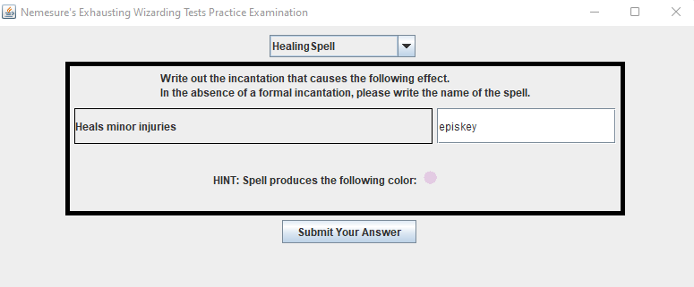

# NEWTs Practice Exam

This project creates a practice examination for wizarding students in Hogwarts
who are about to take the NEWTs (Nemesure's Exhausting Wizarding Tests)

Students select categories of spells, and they are then shown an effect of a spell
belonging to that category. They must write either the correct incantation or the name 
of the spell to get credit for the question.

This project uses:
- [Wizard World API](https://wizard-world-api.herokuapp.com/swagger/index.html)
- [Retrofit](https://square.github.io/retrofit/)
- Gson
- [Mockito](https://site.mockito.org/)
- Junit
- Rx
- Gradle

